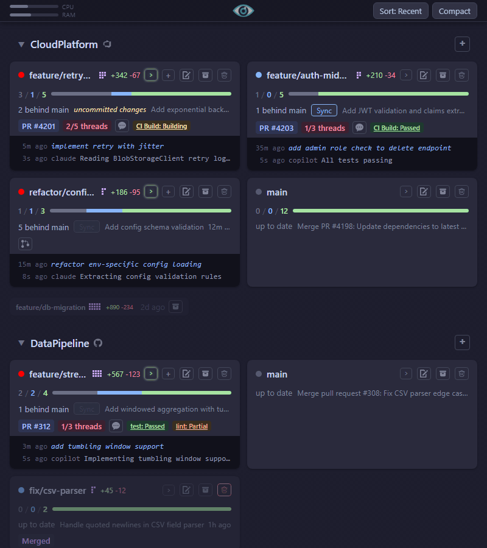

<!-- <p align="center">
  
</p> -->

<h1 align="center">Treemon</h1>

<p align="center">
  <b style="font-size: 1.2em">The mission control center for the AI-assisted developer.</b><br/>
  When you have dozens of AI agents working autonomously across various git worktrees, keeping track of them becomes impossible. Terminals get lost, PRs sit forgotten, and context is lost. Treemon solves this by giving you a unified view.
</p>

---

<p align="center">
  
</p>

## Why Treemon?

When orchestrating massive parallel work by agents (like Claude Code or Copilot), Treemon provides:

- 🦅 **Bird's-eye view:** See exactly which agent is waiting for input, which PR is failing tests, and which branch has unpushed commits.
- ⚡ **Lightning-fast context switching:** Spatial keyboard navigation lets you instantly jump to the exact Windows Terminal tab for any active worktree.
- 🧹 **Zero configuration:** No hooks or agents to install inside your repos. Just point it at a folder and it works.

### Dashboard Capabilities

Point Treemon at one or more directories, and it runs a lightweight background polling loop (reading git, CLI tools, and file mtimes) to track:

- **AI Agent Status:** Claude Code and Copilot session tracking (Working / Waiting / Done / Idle)
- **Terminal Management:** Spawn, focus, and track Windows Terminal tabs per worktree
- **Git State:** Dirty / behind-main indicators, one-click branch sync, and commit metrics
- **PR Tracking:** Azure DevOps and GitHub PR badges, comment counts, and build results
- **Task Tracking:** [Beads](https://github.com/steveyegge/beads) completion and progress bars

## Getting started

Prerequisites: [.NET SDK 9](https://dotnet.microsoft.com/download), [Node.js](https://nodejs.org), git. Optional: `az` CLI (for Azure DevOps PR/build data), `gh` CLI (for GitHub PR/build data), `bd` CLI (for [beads](https://github.com/steveyegge/beads) counts).

```
npm install
```

### Production

```powershell
.\treemon.ps1 start "C:\code\my-project" "C:\code\other-project"   # start on port 5000
.\treemon.ps1 stop                                                  # stop
.\treemon.ps1 status                                                # show PID, port, uptime
.\treemon.ps1 log                                                   # tail server log
```

Open http://localhost:5000 — install as a PWA from the browser for a native app experience.

### Development

```powershell
.\treemon.ps1 dev "C:\code\my-project" "C:\code\other-project"      # server :5001 + Vite :5174
```

Open http://localhost:5174 (Vite proxies API calls to the server).

### Deploy

```powershell
.\treemon.ps1 deploy                         # build frontend → wwwroot/, restart prod
```

## Stack

F# on both sides — [Saturn](https://saturnframework.org) server, [Fable](https://fable.io) + [Elmish](https://elmish.github.io) client, [Fable.Remoting](https://github.com/Zaid-Ajaj/Fable.Remoting) for type-safe RPC, [Vite](https://vitejs.dev) for dev tooling. Supports multiple root directories with auto-detected PR providers (Azure DevOps, GitHub).
