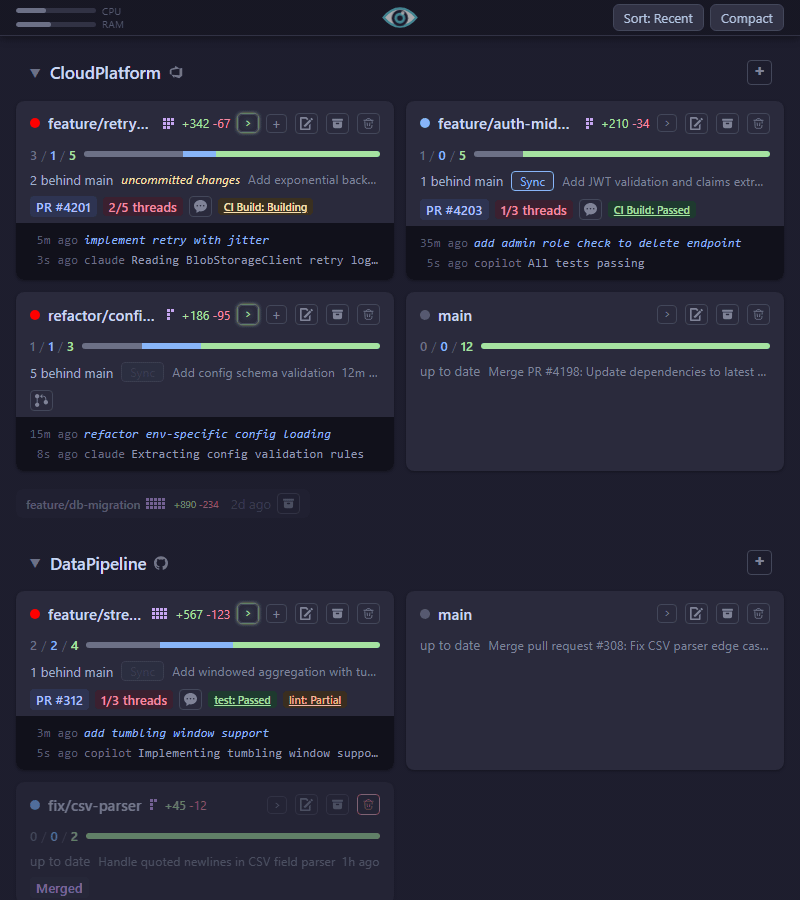

<!-- <p align="center">
  
</p> -->

<h1 align="center">Treemon</h1>

<p align="center">
  <b style="font-size: 1.2em">The mission control center for the AI-assisted developer.</b><br/>
  When you have dozens of AI agents working autonomously across various git worktrees, keeping track of them becomes impossible. Terminals get lost, PRs sit forgotten, and context is lost. Treemon solves this by giving you a unified view.
</p>

---

<p align="center">
  
</p>

## Why Treemon?

When orchestrating massive parallel work by agents (like Claude Code or Copilot), Treemon provides:

- 🦅 **Bird's-eye view:** See exactly which agent is waiting for input, which PR is failing tests, and which branch has unpushed commits.
- ⚡ **Lightning-fast context switching:** Spatial keyboard navigation lets you instantly jump to the terminal for any active worktree.
- 🧹 **Zero configuration:** No hooks or agents to install inside your repos. Just point it at a folder and it works.

### Dashboard Capabilities

Point Treemon at one or more directories, and it runs a lightweight background polling loop (reading git, CLI tools, and file mtimes) to track:

- **AI Agent Status:** Claude Code and Copilot session tracking (Working / Waiting / Done / Idle), including delegated sub-agents. Copilot reports through its session extension; Claude Code through hooks — see [`src/ClaudeHooks`](src/ClaudeHooks/README.md). Set `{ "codingTool": "claude" }` in a worktree's `.treemon.json` to have Treemon launch and resume Claude there.
- **Terminal Management:** Embedded terminals per worktree on every platform, plus spawning and focusing native Windows Terminal tabs on Windows
- **Git State:** Dirty / behind-base indicators, persistent agent-driven auto-sync, and commit metrics
- **PR Tracking:** Azure DevOps and GitHub PR badges, comment counts, and build results
- **Task Tracking:** [Beads](https://github.com/steveyegge/beads) completion and progress bars

## Getting started

### Prerequisites

- [.NET SDK 10+](https://dotnet.microsoft.com/download) — the version is pinned in `global.json`
- [Node.js](https://nodejs.org), including **npm**. Ubuntu's `nodejs` package does not include npm; install the `npm` package too, or the build picks up something unexpected from `PATH`.
- git

Optional, each unlocking one part of the dashboard: `az` (Azure DevOps PRs and builds), `gh` (GitHub PRs and builds), `bd` ([beads](https://github.com/steveyegge/beads) task counts). Fable and the other dotnet tools restore themselves on first build.

### Install and run

`treemon.cmd` (Windows) and `treemon.sh` (Linux, macOS) are the same script — thin wrappers around `treemon.fsx`, which runs on `dotnet fsi`. Neither needs PowerShell.

```bash
git clone https://github.com/0101/treemon.git
cd treemon
./treemon.sh setup-ttyd                    # pinned ttyd, required before the first build
./treemon.sh publish                       # build and publish the server
./treemon.sh start ~/code/my-project       # builds the frontend if wwwroot/ is empty
```

On Windows the same three commands are `treemon.cmd setup-ttyd`, `treemon.cmd publish`, `treemon.cmd start "C:\code\my-project"`.

`setup-ttyd` has to run before anything builds, because the pinned ttyd is a build input rather than something fetched during the build. Forget it and the build stops with a message naming the command to run.

Then open **http://localhost:5000** — install it as a PWA from the browser for a native app experience.

Windows has a one-step alternative that also installs the `tm` command, the agent skill and the editor extension:

```powershell
pwsh -File .\treemon.ps1 deploy
```

`deploy` is the **only** command that needs [PowerShell 7+](https://github.com/PowerShell/PowerShell) (`winget install Microsoft.PowerShell`), and it is Windows-only. Windows PowerShell 5.1 cannot run `treemon.ps1` — `Join-Path` takes only two segments there — and says so up front rather than failing partway through a deploy.

Everything else runs through `treemon.cmd`, which uses no PowerShell at all and works from cmd, Windows PowerShell 5.1 or pwsh alike.

### Managing the server

```bash
./treemon.sh status                        # PID, ports, log location, configured roots
./treemon.sh log                           # print the current server log
./treemon.sh restart ~/code/my-project     # roots are not remembered - repeat them
./treemon.sh stop
./treemon.sh add ~/code/another-project    # watch a root (applies on the next restart)
./treemon.sh remove ~/code/another-project
./treemon.sh roots                         # list watched roots
```

Roots you add are saved to the global config (`~/.treemon/config.json` → `worktreeRoots`, written by the server), so `start` and `restart` can be given no path at all — omit it to use the saved roots. A path passed on the command line is used for that run only and is **not** saved, which is why `restart` without arguments falls back to the saved ones.

### Ports

| | Port | Override |
|---|---|---|
| Dashboard | 5000 | `TREEMON_PORT` |
| Canvas documents | 5002 | `TREEMON_CANVAS_PORT` |
| Dev server / Vite | 5001 / 5174 | — |

The canvas server is a second listener in the same process, and **the server exits if it cannot bind it** — so to run two instances at once (say one on Windows and one in WSL) move both ports, not just `TREEMON_PORT`:

```bash
TREEMON_PORT=5061 TREEMON_CANVAS_PORT=5072 ./treemon.sh start ~/code/my-project
```

One checkout tracks one server, because the PID it records lives in the checkout. A second instance needs a second checkout.

### Development

```bash
./treemon.sh dev ~/code/my-project         # server on 5001 plus Vite on 5174
```

Open http://localhost:5174 — Vite proxies API calls to the server.

## CLI

`tm` drives a running server from the command line. On Windows `.\treemon.ps1 deploy` puts it on your PATH (restart your shell to pick it up); elsewhere, and before any deploy, reach the same commands through `./treemon.sh add|remove|roots` or run `dotnet run --project src/Cli -- <args>`.

```bash
tm launch --path ~/code/my-project --prompt-file task.md   # launch an agent with a prompt file
tm launch --path ~/code/my-project --fix-pr <url>          # fix PR comments
tm launch --path ~/code/my-project --fix-build <url>       # fix a failed build
tm launch --path ~/code/my-project --create-pr             # create a pull request
tm new --repo ~/code/my-project --branch feature/foo       # create a worktree
tm worktrees                                               # list all worktrees
tm terminals                                               # list embedded terminals and session activity
tm add ~/code/my-project                                   # watch a root
tm remove ~/code/my-project                                # stop watching a root
tm roots                                                   # list watched roots
tm categories                                              # report what the repo's diff categories match
```

All commands accept `--port` (default 5000, env `TREEMON_PORT`).

## Platform notes

### Windows

Everything is supported. Run production `start`, `restart` and `deploy` from an ordinary terminal rather than a Treemon embedded terminal — `add` and `remove` still save root changes there, but skip the automatic restart, so an external `restart` is needed before the running server sees them.

### Linux

x64 and arm64. The dashboard, the git/PR/beads polling and the embedded terminals all work; an embedded terminal opens `$SHELL`, falling back to `/bin/bash`. CPU and memory come from `/proc`.

Spawning and focusing **native** Windows Terminal windows is the one feature with no counterpart — asking for one answers with a platform message. Use an embedded terminal instead.

`deploy` is Windows-only, so use `publish` plus `start`; that skips installing `tm`, the skill and the editor extension.

### macOS

**Unverified.** The code paths exist and nothing in them is knowingly Windows- or Linux-specific, but no part of Treemon has been run on a Mac. Treat it as "should work, untested".

Two known differences. `setup-ttyd` cannot download a pinned build, because upstream publishes none for macOS — it adopts whatever `ttyd` is on your `PATH` (`brew install ttyd`) and only reports the version it finds. Treemon proxies ttyd's protocol, so a build far from the pinned 1.7.7 is the first thing to suspect if embedded terminals misbehave. And CPU/memory readings are Windows and Linux only; the dashboard omits them elsewhere.

## Stack

F# on both sides — [Saturn](https://saturnframework.org) server, [Fable](https://fable.io) + [Elmish](https://elmish.github.io) client, [Fable.Remoting](https://github.com/Zaid-Ajaj/Fable.Remoting) for type-safe RPC, [Vite](https://vitejs.dev) for dev tooling. Supports multiple root directories with auto-detected PR providers (Azure DevOps, GitHub).
